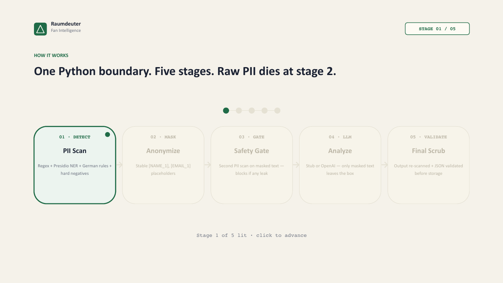

# Privacy-First Fan Intelligence Pipeline

> **GDPR-safe AI analysis of football fan messages. Raw PII never reaches the LLM and is never stored.**

[](https://fan-pulse-guard.vercel.app)


Built for the **Raumdeuter AI Hackathon (2026)** challenge. · **[Live demo](https://fan-pulse-guard.vercel.app)** · [Pitch deck (PDF)](pitch/Raumdeuter-Pitch.pdf) · [Product requirements](docs/PRD.md)

## The problem

Every football club wants AI on its fan messages: support tickets, emails, social posts.
These messages contain names, emails, phone numbers, booking IDs and home cities. Most AI
pipelines send them straight to a third-party LLM, which is a GDPR problem.

## The solution

A single backend boundary that **detects and masks PII before any LLM call**, checks the
masked text again, and checks the LLM's output a third time before anything is shown or stored.

```text
"Hi, I am John Miller from Berlin. My email is john.miller@gmail.com and I need help with booking BK-92811."
                                        │  (real output of the detector + anonymizer)
                                        ▼
"Hi, I am [NAME_1] from [CITY_1]. My email is [EMAIL_1] and I need help with booking [BOOKING_ID_1]."
                                        │  (only this reaches the LLM)
                                        ▼
{ sentiment, topic, intent, urgency, summary, recommended_action }   (re-scanned for PII, then stored)
```



| # | Stage | What it does |
|---|-------|--------------|
| 1 | **Detect** | Regex + Microsoft Presidio NER + custom German rules, plus hard negatives (`Gate C` and `Match Day 12` stay unmasked) |
| 2 | **Mask** | Stable placeholders such as `[NAME_1]`, `[EMAIL_1]` |
| 3 | **Safety gate** | A second PII scan on the masked text. **Blocks the LLM call** if anything leaks |
| 4 | **Analyze** | Sentiment, topic, intent, urgency, summary, recommended action (offline stub or a pluggable LLM provider) |
| 5 | **Validate** | A final PII scan plus JSON validation of the LLM output before storage |

## Privacy guarantees

1. Raw PII never reaches the LLM.
2. Raw PII is never stored in PostgreSQL.
3. Logs never contain raw PII.
4. PII entity values are never persisted (there is no `entity_value` column).
5. Only masked messages, PII metadata, analysis, latency, status and timestamps are stored.
6. A second PII scan runs on the masked message before any LLM call.
7. A final PII scan runs on the LLM output before display or storage.
8. If masking is incomplete, the LLM call is blocked.
9. The frontend never runs PII detection.
10. The frontend never holds LLM secrets.

These guarantees are enforced by tests. The leak test checks that no raw email, phone number,
ID or name survives into the masked message, the stored row or the LLM analysis.

## Tech stack

| Layer | Tools |
|-------|-------|
| Frontend | Next.js 15 (App Router), React 19, TypeScript, Tailwind CSS v4, shadcn-style UI, Zod |
| Backend | Python 3.12, FastAPI, Pydantic v2, SQLAlchemy 2.0, Alembic, psycopg v3 |
| Privacy | Microsoft Presidio (Analyzer + Anonymizer), spaCy, custom regex + German rules |
| Data | PostgreSQL 16 |
| Tooling | uv, Ruff, pytest, mypy (backend) · pnpm, ESLint, Prettier (frontend) · Docker Compose |

## Quick start (Docker)

```bash
git clone https://github.com/M-Afzaal-Afzal/gdpr-fan-intelligence.git
cd gdpr-fan-intelligence
docker compose up --build
```

- Frontend: <http://localhost:3000>
- API docs (Swagger): <http://localhost:8000/docs>
- PostgreSQL: `localhost:5432` (local dev credentials `postgres` / `postgres`)

No API key is needed. The default `LLM_PROVIDER=stub` runs the full pipeline offline. To use a
real model, set `LLM_PROVIDER` in `backend/.env` to `openai`, `anthropic`, `gemini`, `fireworks`,
`huggingface` or `ollama` (local), and add that provider's key (see `backend/.env.example`).
The provider only ever receives masked text.

## Local setup

### Backend

```bash
cd backend
uv sync
cp .env.example .env
docker compose up -d postgres                    # from repo root
uv run alembic upgrade head
uv run python -m spacy download en_core_web_sm   # enables full NAME/CITY NER
uv run uvicorn app.main:app --reload
```

> Without the spaCy model, the pipeline still masks structured PII (emails, phones, IDs,
> handles), cities from a built-in list, and names found by a self-introduction heuristic.

### Frontend

```bash
cd frontend
pnpm install
cp .env.example .env.local
pnpm dev
```

## API

| Method | Path | Purpose |
|--------|------|---------|
| POST | `/api/analyze-message` | Run the privacy pipeline on one message |
| GET | `/api/results` | Recent stored results (`?limit=`) |
| GET | `/api/results/{id}` | One result by UUID |
| GET | `/api/metrics` | Dashboard aggregates |
| GET | `/api/health` | API + DB status |

Full reference: [`docs/api.md`](docs/api.md) · Architecture: [`docs/architecture.md`](docs/architecture.md)

## Demo flow

1. Open the home page and click **English with PII**, or paste your own message.
2. Click **Analyze Safely** to see the raw input, detected PII, masked message, AI insight and privacy status.
3. Try **No-PII hard negative**: `Gate C`, `Match Day 12` and `Block 14` stay unmasked, so there are no false positives.
4. Try **Prompt-injection test**: PII is still masked, and the injection text is analyzed as ordinary masked content.
5. Open **Dashboard** for aggregates and **Architecture** for the pipeline story.

Sample inputs (English, German and mixed) are in [`data/sample_messages.jsonl`](data/sample_messages.jsonl).
All names and contact details in them are fictional.

## Tests & quality

```bash
# Backend
cd backend
uv run pytest                 # 77 tests, including the PII leak tests
uv run ruff check . && uv run mypy app

# Frontend
cd frontend
pnpm lint && pnpm type-check && pnpm build
```

## Project layout

```text
gdpr-fan-intelligence/
├── backend/          FastAPI service
│   └── app/services/ pii_detector → anonymizer → safety_gate → llm_service → output_validator
├── frontend/         Next.js 15 + Tailwind v4 + shadcn-style UI
├── data/             sample_messages.jsonl
├── docs/             architecture, API, PRD, decisions, AI handoff docs
├── pitch/            hackathon pitch deck (PDF/PPTX) + generator script
└── docker-compose.yml
```

### AI-assisted development

This project was built with several AI coding tools working from one shared context.
[`AGENTS.md`](AGENTS.md) is the canonical instruction file, and `.claude/`, `.cursor/`,
`.kiro/` and `.agents/` point each tool to it. [`docs/AI_HANDOFF.md`](docs/AI_HANDOFF.md)
and [`docs/DECISIONS.md`](docs/DECISIONS.md) record where work stands and why.

## Roadmap

- Dataset evaluation harness (precision/recall/F1, PII leakage rate)
- Batch CSV upload reusing the single-message pipeline
- Stronger German NER (`de_core_news` spaCy model)
- AuthN/AuthZ, rate limiting and an audit-log dashboard for production
